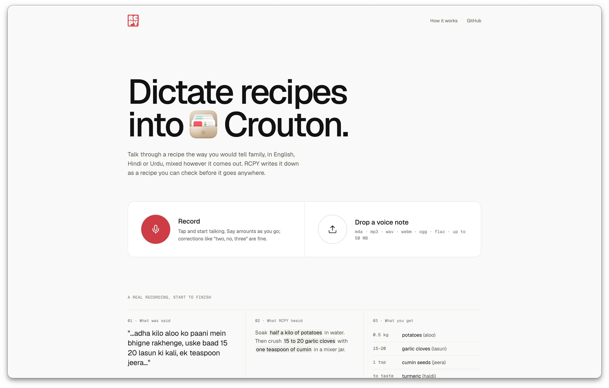
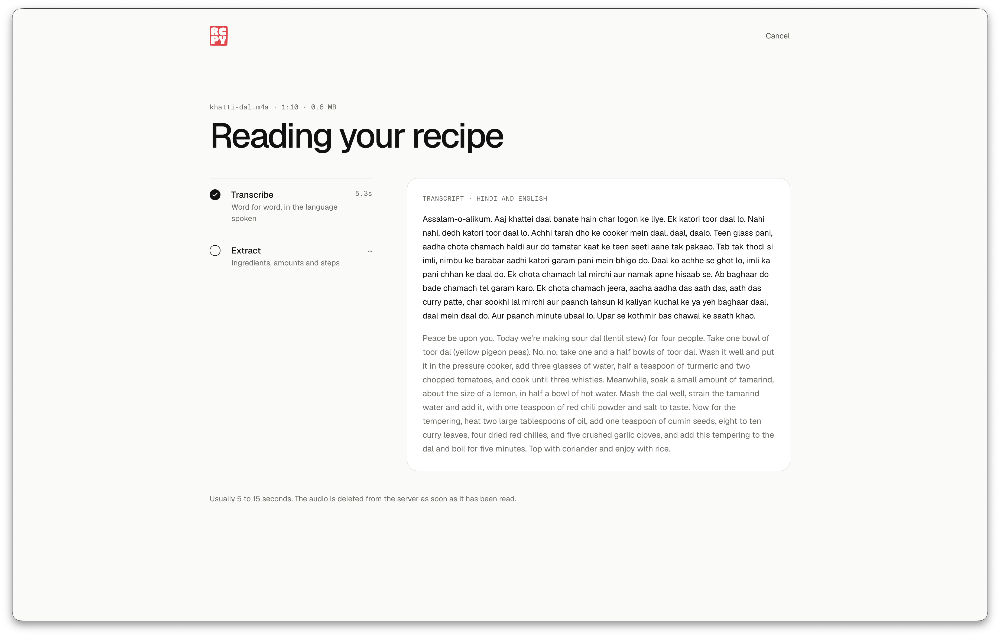
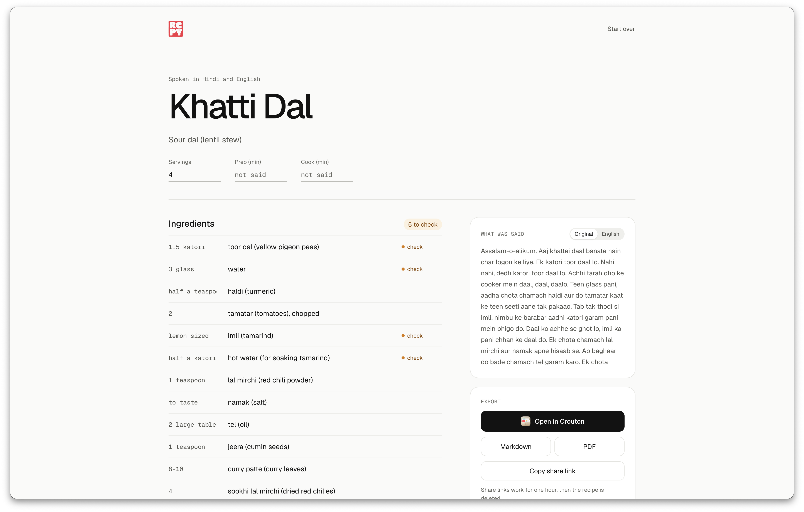
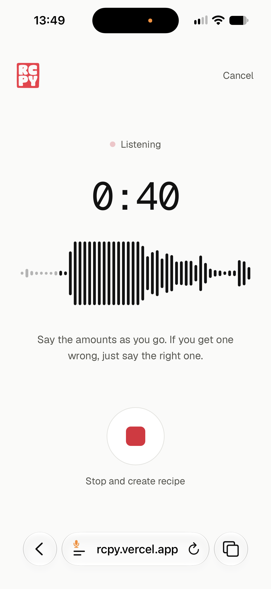
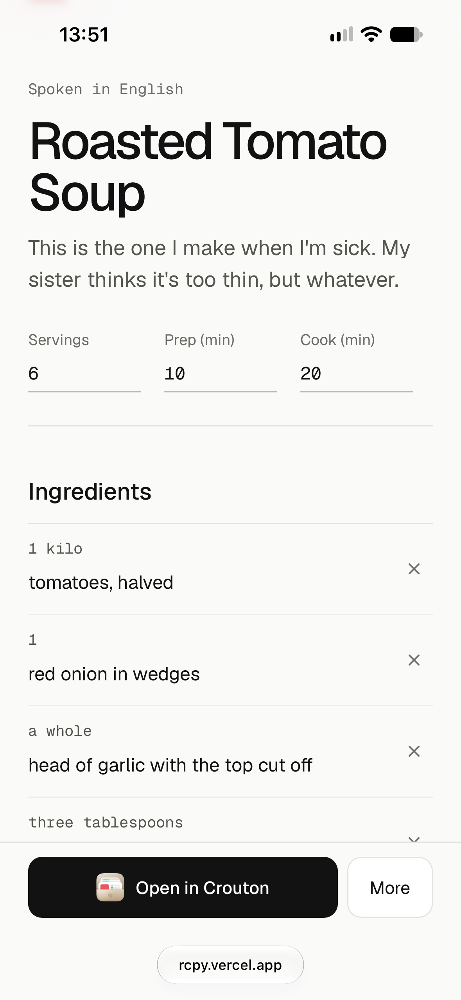
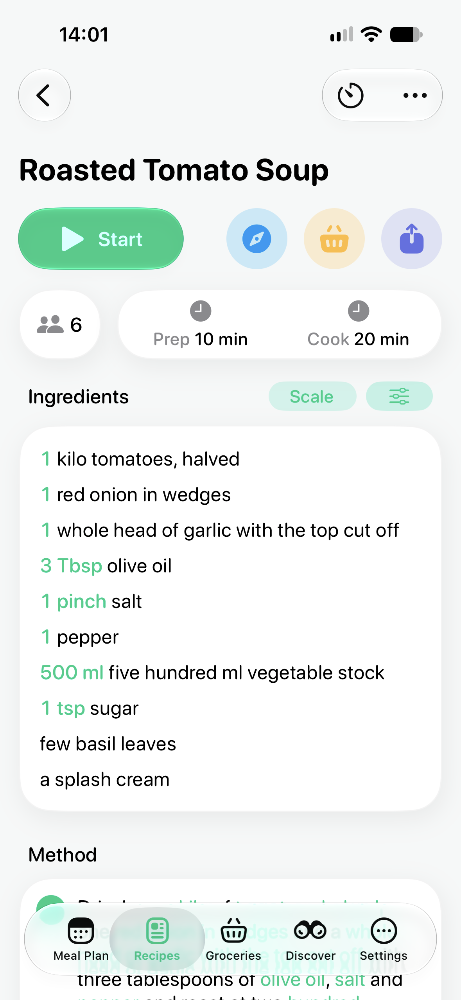
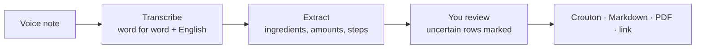
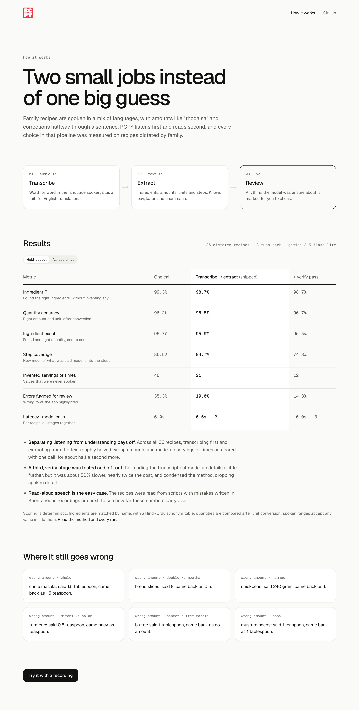

# RCPY

Dictate a recipe the way you'd tell family, in English, Hindi or Urdu, mixed however it comes out. RCPY writes it down as a structured recipe you can check, edit and send to [Crouton](https://crouton.app), Markdown or PDF.

**Try it: [rcpy.vercel.app](https://rcpy.vercel.app)**



| Reading the recording | Checking the result |
| --- | --- |
|  |  |

| Recording on a phone | Reviewing on a phone | Imported into Crouton |
| --- | --- | --- |
|  |  |  |

## Why

Family recipes live in people's heads and come out in conversation: "adha kilo aloo, 15 20 lasun ki kali... nahi, dedh katori". Typing them up is tedious, and general-purpose transcription doesn't know what a *katori* is, which number was the correction, or that "thoda sa" means no number at all. RCPY is built for exactly that speech, and every choice in its pipeline was measured on recordings of it.

## What it does

- **Record or upload.** Record in the browser with a live waveform, or drop a voice note (M4A, MP3, WAV, WebM, OGG, FLAC).
- **Watch it work.** The stages tick off and the transcript appears as soon as it's ready, usually within 5–15 seconds.
- **Check before anything leaves.** Every field is editable in place, and rows the model wasn't sure about are marked "check". The original transcript sits alongside.
- **Export.** Open in Crouton (the `.crumb` opens straight in the app on a phone; a computer shows a QR code), or download Markdown or a PDF.
- **Share for an hour.** Get a public link with a clean recipe page. It and the recipe are deleted after an hour.

## How it works



A Python engine (FastAPI on Gemini 3.5 Flash-Lite) does the listening and reading; a React and TypeScript app does the recording, review and export. Listening and reading are separate model calls: the first writes down what was said, the second turns that text into a recipe, validated against the same schema it was asked for. Details are in [docs/architecture.md](docs/architecture.md).

## Results



Three pipelines compared on 36 recipes dictated by three people (mostly Urdu/Hindi, Hinglish, and English with desi words), each run 3 times. The recipes were read from [scripts](engine/evals/scripts/README.md) with mistakes written in on purpose: self-corrections, ranges, "thoda sa", *pav* and *katori*, forgotten and excluded ingredients. Each script carries its own answer key, and the scoring is deterministic ([engine/evals](engine/evals/README.md)).

| | One call | Transcribe → extract (shipped) | + verify pass |
| --- | --- | --- | --- |
| Right ingredient **and** right amount | 94.5% | 96.7% | **97.0%** |
| Ingredient F1 | **99.0%** | 98.9% | 98.5% |
| Servings or times made up (across 108 runs) | 126 | 52 | **36** |
| Spoken steps that made it into the method | **87%** | 84% | 78% |
| Latency per recipe | **6.0s** | 6.5s | 10.0s |
| Cost per recipe | $0.0032 | $0.0035 | $0.0060 |

On the 12 held-out recipes, which nothing was tuned on, the order is the same: 95.7% / 95.7% / 96.5% for right ingredient and amount, and 46 / 21 / 12 servings or times made up.

What this shows:

- **Finding ingredients is close to solved; amounts and made-up details are where pipelines differ.** Splitting transcription from extraction cut wrong amounts by 40% (5.5% → 3.3%) and made-up servings and times by 59%, for half a second and $0.0003 more per recipe.
- **A verify pass reduces made-up details further, but it costs more than it gains.** On amounts it's level with transcribe → extract (97.0% vs 96.7%), but it's about 50% slower and nearly twice the cost, and it condenses the method, dropping spoken detail from the steps. Transcribe → extract is the default; `STRATEGY=staged` turns the verify pass on.
- **Remaining errors are the hard kind:** "aath" (eight) bread slices heard as "aadha" (half), and chole masala in tablespoons came back as teaspoons.
- **Caveats:** read-aloud speech is more fluent than spontaneous speech, so unscripted recordings are next. The step metric compares words, so rewording counts against a pipeline even when nothing was lost.

How the dataset was chosen is recorded in [ADR-0001](docs/adr/0001-eval-dataset-sourcing.md). Scoring and prompt changes, with their effect on the numbers, are logged in the [evals README](engine/evals/README.md#scoring-changes).

## Quick start

You need Python 3.13+ with [uv](https://docs.astral.sh/uv/), and Node.js 22.12+. Demo mode needs no API key: every recording returns the same sample recipe, which is enough to try the whole flow.

```bash
git clone https://github.com/rayyanarchy/rcpy.git && cd rcpy
cp .env.example .env                      # set DEMO_MODE=true, or add GEMINI_API_KEY
cd web && npm ci && npm run build
cd ../engine && uv sync --all-extras
uv run rcpy serve                         # open http://127.0.0.1:3000
```

For real recordings, put a [Gemini API key](https://aistudio.google.com/apikey) in `.env` and set `DEMO_MODE=false`. To develop with hot reload, see [docs/development.md](docs/development.md).

The engine also works from the command line:

```bash
cd engine
uv run rcpy parse my-recipe.m4a -f md      # recipe as Markdown on stdout
```

## Configuration

Set these in `.env` (repo root or `engine/`), or as environment variables.

| Variable | Default | Description |
| --- | --- | --- |
| `GEMINI_API_KEY` | – | Google Gemini API key. Required unless `DEMO_MODE` is on. |
| `GEMINI_MODEL` | `gemini-3.5-flash-lite` | Model used for every stage. |
| `STRATEGY` | `staged-lite` | `staged-lite` (transcribe → extract), `staged` (adds a verify pass), or `single` (one call). |
| `DEMO_MODE` | `false` | `true` returns a canned recipe instead of calling Gemini. |
| `MAX_AUDIO_MB` | `50` | Largest accepted upload. |
| `DATABASE_URL` | – | Postgres for saved recipes (for example Neon). Without it they're JSON files in `DATA_DIR`. |
| `DATA_DIR` | `./data` | Local recipes, recordings, outputs and eval cases. |
| `EVALS_DIR` | `./evals` | Eval summaries and `pricing.json`. |
| `PUBLIC_BASE_URL` | – | Base URL for share links. Leave unset to use the request's own host. |
| `SHARE_URL` | `https://rcpy.vercel.app` | Server that `rcpy parse --share` publishes to. |

## Documentation

| Doc | For |
| --- | --- |
| [docs/architecture.md](docs/architecture.md) | How the engine, pipeline, API and web app fit together, and why |
| [docs/development.md](docs/development.md) | Setup, daily commands, layout, how to make common changes |
| [docs/api.md](docs/api.md) | Endpoints, the streaming events, errors and limits |
| [docs/deploy.md](docs/deploy.md) | Vercel setup, environment, releasing, rollback, troubleshooting |
| [engine/evals/README.md](engine/evals/README.md) | The evals: workflow, answer-key rules, metrics, change log |
| [engine/evals/scripts/README.md](engine/evals/scripts/README.md) | The dictation scripts and how to record them |
| [docs/adr/](docs/adr/) | Decision records |

## Privacy

Audio is sent to Google's Gemini API to be processed. RCPY's temporary copy, and the copy uploaded to Gemini, are deleted as soon as processing finishes. Recipes are only stored when you share them or open them in Crouton, and they're deleted an hour after being saved. Anyone with a recipe's link can view it during that hour. Your draft stays in your own browser until you start over.

## Tech stack

- **Engine:** Python 3.13, Google Gen AI SDK (Gemini), Pydantic v2, FastAPI, Typer and Rich
- **Storage:** Postgres (Neon) via psycopg, or JSON files
- **Web:** React 19, TypeScript, Vite, Geist and Geist Mono, Lucide icons
- **Quality:** pytest, Vitest, ruff, prettier, GitHub Actions
- **Hosting:** Vercel (static app and a Python function)

## Roadmap

- [x] Staged pipeline (transcribe, extract, verify) alongside the original single-call baseline
- [x] Eval harness with deterministic scoring for ingredients, quantities, steps and invented values
- [x] Redesigned web app in TypeScript, with live progress, inline review and Crouton export
- [x] 36 scripted family dictations with answer keys, a third of them held out
- [x] Benchmark single, staged and staged-lite, and make the winner (staged-lite) the default
- [x] Results on the How it works page, with real failure examples
- [x] Deployed on Vercel
- [ ] Unscripted ("freestyle") recordings, to check how far the scripted numbers carry over
- [ ] Show where each ingredient came from: the matching words in the transcript, with replay of that moment of the audio

## Credits

RCPY is an independent project and is not affiliated with or endorsed by Crouton. Geist and Geist Mono are used under the SIL Open Font License.

## License

[MIT](LICENSE)
