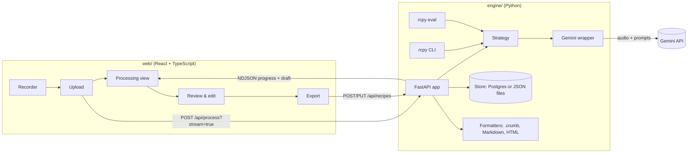

# Architecture

RCPY turns a voice note of someone talking through a recipe into a structured recipe that can be checked, edited, and exported. This page covers how the pieces fit together and why they're built the way they are. For running things, see [development.md](development.md); for the HTTP interface, [api.md](api.md).

## The parts

| Part | Where | Job |
| --- | --- | --- |
| **Engine library** | `engine/src/rcpy/` | Audio in, validated `ParseResult` out. Everything else builds on it. |
| **CLI** | `rcpy parse`, `rcpy serve`, `rcpy eval` | Parse files to JSON/Markdown/HTML, run the API, run the evals. |
| **API** | `rcpy/api.py` | FastAPI app: processing with streamed progress, saving and sharing recipes, exports, the public recipe page, and serving the built web app. |
| **Web app** | `web/src/` | The product: record or upload, watch it work, review, export. |
| **Evals** | `rcpy/evals/`, `engine/evals/` | Score parse strategies against recordings with known answers. |

On Vercel, the web app is served as static files and the engine runs as one Python function (`api/index.py`); see [deploy.md](deploy.md).

## From audio to recipe

`strategies.parse_audio(path, settings)` is the single entry point used by the CLI, the API and the evals:

1. Checks the file type and size.
2. In demo mode, returns a canned recipe and walks through the strategy's stages, so progress UIs work without an API key.
3. Otherwise runs the configured **strategy** and tidies the result: any quantity still written in words is rewritten from its amount and unit ("five hundred ml" becomes "500 ml").

A strategy is `run(gemini, path, mime) -> ParseResult`, registered in `strategies.STRATEGIES`:

| Strategy | Model calls | What happens |
| --- | --- | --- |
| `staged-lite` (**default**) | 2 | **Transcribe** the audio word for word, plus an English translation, then **extract** the recipe from that text. |
| `staged` | 3 | The same, plus a **verify** pass that re-reads the transcript and corrects the recipe. |
| `single` | 1 | One multimodal call, audio straight to recipe. The original baseline. |

The default was chosen by measurement, not intuition (see [Results](../README.md#results)). Splitting listening from understanding cut wrong amounts by 40% and made-up servings or times by more than half, for about half a second more. The verify pass cut made-up details further but was about 50% slower, nearly twice the cost, and dropped detail from the steps.

All Gemini access goes through `strategies/_gemini.py`, which:

- uploads the audio for the duration of the call and deletes it from Google's side afterwards;
- asks for JSON matching a Pydantic schema and validates the reply against the same schema;
- retries rate limits (429) and overload (503), waiting as long as Gemini asks, and gives up on waits over 90 seconds (a daily quota);
- turns API and network failures into short messages people can read, keeping the raw text for logs;
- records each call's latency and token counts into an optional `Trace`, and reports progress to a listener (the API streams it; the evals keep it for latency and cost).

## Data models

Two layers, deliberately kept apart:

- **`schema.py`**: `ParseResult`, `Recipe`, `Ingredient`, `Step`, `Unit`. The source of truth for what a recipe is. The same models are sent to Gemini as the response schema and used to validate what comes back, so a bad reply fails loudly instead of reaching a formatter. Changing these changes what the model is asked for.
- **`draft.py`**: `RecipeDraft` (a flattened `ParseResult` with an id on every ingredient and step, so the editor can track rows) and `StoredRecipe` (adds slug and timestamps). These use **camelCase on the wire**, the web app's convention, and snake_case in Python. `web/src/lib/types.ts` mirrors them and must stay in sync.

Each ingredient keeps both a display `quantity` ("1.5 katori", "to taste") and a numeric `amount` + `unit`. Crouton imports the numbers; people read the text. Ingredients and steps also carry `uncertain`, which the review screen shows as an amber "check" marker.

## Progress streaming

Processing takes 5–15 seconds, so the API can stream progress instead of making the browser wait for one response. With `?stream=true`, `POST /api/process` returns newline-delimited JSON: a `plan` listing the stages, `stage` start/done events with timings, a `transcript` event as soon as the transcribe stage finishes, and finally a `draft` or an `error`. The Gemini work runs in a background thread that puts events on a queue; the response generator drains it. The web app (`lib/api.ts`) reads the stream and drives the Processing screen from it. Event shapes are in [api.md](api.md#streaming-events).

## Storage and sharing

Saved recipes exist so they can be shared and imported. They are deliberately short-lived: **every saved recipe expires one hour after it is first saved** (edits don't extend it) and is deleted lazily the next time it is read. `Store` implements save, get, update and expiry once; subclasses only read, write and delete one row:

- `PostgresStore` when `DATABASE_URL` is set (table `rcpy_recipes`, compatible with the original Node app's schema);
- `FileStore` otherwise, writing JSON to `<DATA_DIR>/recipes/`.

Slugs are random and validated against a strict pattern before any lookup. `/r/{slug}` is a server-rendered page (`formatters.to_html`) styled like the web app, with Open in Crouton, Markdown and Print actions and a live expiry countdown.

## Exports

| Format | Built by | Notes |
| --- | --- | --- |
| Crouton `.crumb` | `formatters.to_crumb` (server) | JSON in Crouton's import format. On a phone, opening the file imports it; on a computer, the web app shows a QR code for the recipe page instead. |
| Markdown | `lib/export.ts` (browser), `formatters.to_markdown` (server, CLI) | Checklist ingredients, numbered method. |
| PDF | `lib/export.ts` (browser) | A print-styled page; save as PDF from the print dialog. |
| JSON-LD | `formatters.to_json_ld` | Embedded in the public recipe page as schema.org/Recipe. |

## The web app

`App.tsx` is the whole flow as a small state machine: home → recording → processing → review, plus a second page, `/how-it-works`. A tiny History-API router (`lib/router.ts`) is enough for two pages. Client-side routes also need an entry in `SPA_PAGES` in `api.py`, so a refresh serves `index.html`.

- `hooks/useRecorder.ts`: `MediaRecorder` at 32 kbps (plenty for speech; about 15 minutes fits under Vercel's upload cap) and an `AnalyserNode` for the live waveform.
- `lib/quantity.ts`: turns what a person types into an amount field ("1 1/2 tbsp", "adha kilo") into Crouton's amount and unit.
- `lib/results.ts`: bundles the eval summaries from `engine/evals/results/` at build time, so the results page needs no API.
- The draft is kept in `localStorage` so a reload doesn't lose edits.

Design tokens and shared button styles are in `styles/base.css`. The look is near-monochrome Geist and Geist Mono, with the RCPY red used only for recording and amber only for "check this".

## Measuring it

The evals ([engine/evals/README.md](../engine/evals/README.md)) run a strategy over recordings with known answers and score it. Matching is deterministic, so a change in the numbers means the strategy changed, not the judge:

- fuzzy ingredient matching with a Hindi/Urdu synonym table;
- quantities compared after unit conversion, with spoken ranges accepted anywhere inside them and vague measures (*katori*, a pinch) scored on the number only;
- made-up servings and times counted separately;
- latency, tokens and cost per recipe recorded alongside.

Predictions are cached, so scoring changes are re-applied to every run without calling the model again. The dataset is 36 scripted family dictations with answer keys; why it was built that way is in [ADR-0001](adr/0001-eval-dataset-sourcing.md).

## Decisions worth knowing

- **Python for the engine, TypeScript for the web app.** The AI pipeline, the evals and the CLI share one library; the browser only needs to record, display and edit.
- **One schema for prompting and validation.** The model can't drift from what the code expects without failing a test or a request.
- **Pipeline choice by evals.** Strategies are interchangeable behind one interface, so they can be compared on identical inputs, and the default changes with a single setting.
- **Ephemeral sharing.** RCPY converts recipes; Crouton is the library. An hour is enough to import or export, and nothing personal is kept.
- **Audio isn't kept.** Uploads go to a temp file and Gemini's file store, and both are deleted as soon as processing finishes.
